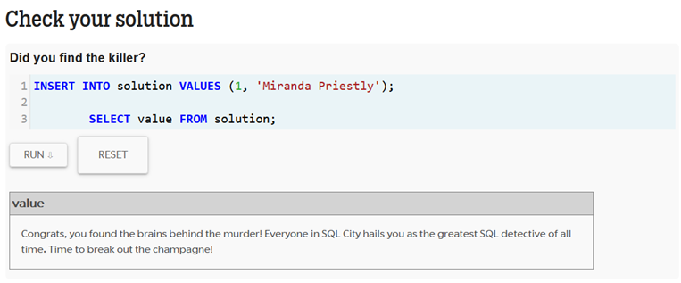

# Jogos de Banco de Dados
Foram propostas 3 atividades relacionadas a banco de dados e SQL.
<br><br>
<strong>1. SQL Island</strong>
<br>
A primeira atividade consistia em resolver dilemas através de código SQL, com objetivo de práticar a manipulação de banco de dados estruturado. Site da atividade: "https://sql-island.informatik.uni-kl.de/".
<br>
*o resultado dessa atividade está no arquivo .pdf*
<br>
<br>
<strong>2. SQL City</strong>
<br>
A segunda atividade consistia em resolver um mistério de assassinato fictíceo por meio de análise de dados, a fim de práticar as noções de interpretação de dados e busca SQL. Site da atividade: "https://mystery.knightlab.com/".
<br>

### Código dessa atividade:
```
--select * from crime_scene_report
--	where crime_scene_report.date = "20180115"
--	and type = "murder" and city = "SQL City";

--select * from interview
--	where person_id = "14887" or person_id = "16371";

--select * from drivers_license
--	where plate_number like "%H42W%";

--select * from get_fit_now_member
--	where membership_status = "gold" and id like "%48Z%";
 
--select * from person
--	where id = "28819" or id = "67318";
 
--select * from interview
--	where person_id = "67318";
 
--select * from drivers_license
--	where hair_color = "red" and car_make like "%Tesla%";
 
--select * from facebook_event_checkin
--	where person_id = "90700" or person_id = "99716";
```
<strong>3. JarMont</strong>
<br>
A terceira atividade tinha como objetivo construir uma interface utilizando das tecnologias HTML, CSS e JavaScript para ilustrar de forma dinâmica uma tabela de dados, criada de forma autoral, no formato *Storyline*, utilizando a ferramenta "http://storyline.knightlab.com/#make-step-1". O tema dessa atividade foi "História da Jardinagem".
